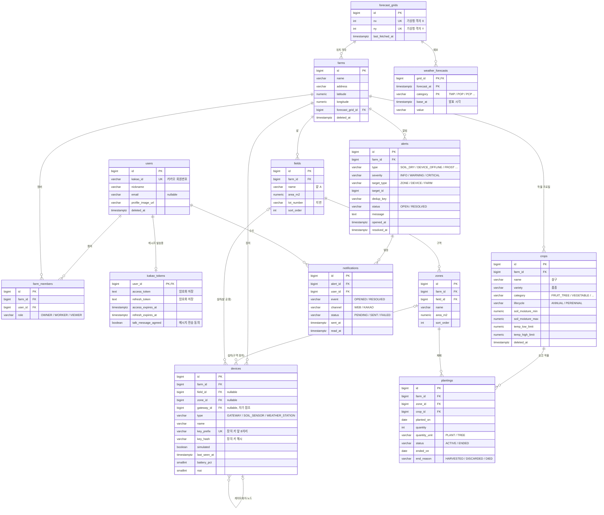
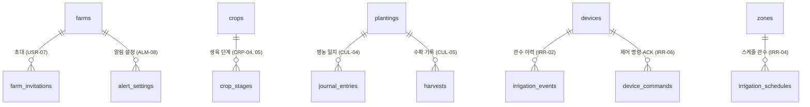

# JinFarm 도메인 모델 (ERD)

> 작성일: 2026-09-30 · 상태: 초안 (v0.2 — 측정값을 InfluxDB로 분리, 장치 최신 상태는 Redis)
> 기준 문서: [01-features.md](01-features.md) v0.6 — **1단계(MVP, P0)** 테이블을 상세 설계하고, 이후 단계는 확장 지점만 정의한다.

## 1. 설계 원칙

| 원칙 | 내용 |
|---|---|
| **농장 단위 격리** | 농장에 속한 모든 테이블에 `farm_id`를 둔다. 상위 테이블을 거쳐 찾을 수 있어도 중복 저장한다 → 모든 조회에 `WHERE farm_id = ?` 한 줄로 격리 (USR-05) |
| 식별자 | `BIGINT` 자동 증가(`GENERATED ALWAYS AS IDENTITY`). 외부에 노출되는 장치 키는 별도 무작위 값 |
| 시각 | `TIMESTAMPTZ`(UTC 저장), 날짜만 필요한 값(파종일 등)은 `DATE` |
| 공통 컬럼 | 대부분의 테이블에 `created_at`, `updated_at` |
| 삭제 | 사용자·농장·작물 등 이력이 걸린 데이터는 **논리 삭제**(`deleted_at`). 측정값·알림은 보관 기간 후 물리 삭제 |
| 코드 값 | DB는 `VARCHAR` + 애플리케이션 `enum`으로 관리 (값 추가 시 마이그레이션 부담 감소) |
| 스키마 관리 | 첫 엔티티 작성 시 **Flyway** 도입, 운영 `ddl-auto`는 `validate`로 변경 (02-infrastructure.md I5) |

## 2. 전체 ERD (1단계)

## 3. 영역별 설명

### 3.1 사용자 · 농장 멤버십

| 테이블 | 설명 | 핵심 제약 |
|---|---|---|
| `users` | 카카오 로그인 사용자 | `kakao_id` UNIQUE. 탈퇴 시 `deleted_at` 기록 후 개인정보 컬럼 비움 |
| `kakao_tokens` | "나에게 보내기"용 카카오 토큰 (ALM-05) | 사용자당 1행. 토큰은 **애플리케이션에서 암호화** 후 저장. 만료·동의 철회 시 발송 실패 → 재동의 안내 |
| `farms` | 농장 | 위경도로 기상청 격자를 계산해 `forecast_grid_id` 연결 |
| `farm_members` | 사용자 ↔ 농장 (N:M) + 역할 | UNIQUE(`farm_id`, `user_id`). 농장 생성자는 `OWNER`. **농장마다 OWNER 최소 1명** (애플리케이션에서 보장) |

> 로그인한 사용자의 "현재 농장"은 세션/요청 헤더로 전달하고, 매 요청마다 `farm_members`로 소속을 확인한다 (USR-04, USR-05).

### 3.2 밭 · 구역 · 장치

| 테이블 | 설명 | 핵심 제약 |
|---|---|---|
| `fields` | 물리적으로 떨어진 밭 (파일럿 농장: 밭 A/B/C) | UNIQUE(`farm_id`, `name`) |
| `zones` | 같은 조건을 공유하는 재배 단위 | UNIQUE(`field_id`, `name`). `farm_id`는 `field`의 농장과 같아야 함 |
| `devices` | 게이트웨이, 토양 센서 노드, 기상 관측 장치 | 아래 "장치 설치 위치" 참고 |

**장치 설치 위치** — `zone_id`, `field_id`로 범위를 표현한다.

| 범위 | `field_id` | `zone_id` | 예 |
|---|---|---|---|
| 구역 장치 | 있음 | 있음 | 구역별 토양 센서 |
| 밭 공용 | 있음 | NULL | 밭 A 기상 센서, (2단계) 밭 단위 밸브 |
| 농장 공용 | NULL | NULL | 게이트웨이, (2단계) 지하수 펌프 |

- CHECK: `zone_id IS NULL OR field_id IS NOT NULL`
- `gateway_id`: 센서 노드가 어느 게이트웨이를 거쳐 통신하는지. 게이트웨이 없이 직접 통신하면 NULL

**장치 인증** (FRM-05)

- 장치 등록 시 무작위 키를 **한 번만** 보여주고, DB에는 `key_prefix`(조회용 앞 8자리)와 `key_hash`(전체 해시)만 저장한다.
- 수신 시 `key_prefix`로 장치를 찾고 해시를 비교한다 → 장치가 속한 `farm_id`가 확정되므로, 다른 농장으로 데이터가 들어갈 수 없다.
- 시뮬레이터 장치도 같은 방식 (`simulated = true`는 화면 표시·운영 차단용일 뿐, 수신 로직은 동일 — SIM-02).

**장치 상태** (FRM-06): 수신할 때마다 **Redis**에 최신 상태(`last_seen_at`, `battery_pct`, `rssi`, 최신 측정값)를 기록하고, PostgreSQL `devices`에는 주기적으로(예: 5분) 반영한다 → 10분마다 오는 측정값 때문에 업무 DB에 쓰기가 몰리지 않는다. 온라인 여부는 저장하지 않고 `last_seen_at`과 현재 시각 차이로 계산한다.

### 3.3 측정값 (InfluxDB)

측정값은 PostgreSQL이 아니라 **InfluxDB**(버킷 `sensor`)에 저장한다. 그래서 위 ERD에 측정값 테이블이 없다.

| 요소 | 값 | 설명 |
|---|---|---|
| measurement | `sensor` | 모든 센서 값을 하나의 measurement에 저장 |
| tag | `farm_id`, `field_id`, `zone_id`, `device_id`, `metric` | 조회 조건. `zone_id`·`field_id`는 **측정 당시** 장치 위치 (구역 없는 장치는 태그 생략) |
| field | `value` (float) | 측정값 |
| time | 장치가 측정한 시각 | 수신 시각이 아님 |

- 같은 (태그 조합, 시각)으로 다시 쓰면 **덮어쓴다** → 장치가 같은 값을 재전송해도 중복 저장되지 않는다 (재전송 안전).
- 농장 격리: 모든 조회에 `farm_id` 태그 필터를 반드시 넣는다 (조회 코드를 한 곳에 모아 강제).
- 장치를 다른 구역으로 옮겨도 과거 데이터의 `zone_id` 태그는 원래 구역으로 남아, 과거 그래프가 원래 구역에 유지된다.
- 보관: 버킷 보관 기간 **365일** (D2). 1년 이후 추세가 필요하면 시간 단위 평균을 별도 버킷(`sensor_hourly`, 장기 보관)에 쌓는 InfluxDB 작업(task)을 추가한다.
- `metric` 값 (1단계):

  | metric | 단위 | 장치 |
  |---|---|---|
  | `SOIL_MOISTURE` | % | 토양 센서 |
  | `SOIL_TEMP` | °C | 토양 센서 |
  | `AIR_TEMP` | °C | 기상 관측 |
  | `AIR_HUMIDITY` | % | 기상 관측 |
  | `RAIN` | 0/1 (감지 여부) | 기상 관측 |

  센서가 늘어나도(EC, 일사량, 풍속 — MON-06) 스키마 변경 없이 `metric` 값만 추가한다.
- 데이터 양 (파일럿 농장 추정): 장치 10대 × 측정 3종 × 10분 간격 → 하루 약 4,300건, 1년 약 160만 건.
  태그 조합 수(농장 × 장치 × metric)가 크지 않아 InfluxDB가 효율적으로 다룬다.

**장치 → 서버 경로**: 장치(또는 시뮬레이터)가 **MQTT**로 발행 → 서버가 구독해 장치 키 확인 → InfluxDB 기록 + Redis 최신 상태 갱신 → 알림 판단.
토픽 구조와 메시지 형식은 `05-api-spec.md`에서 정한다.

### 3.4 작물 · 재배

| 테이블 | 설명 | 핵심 제약 |
|---|---|---|
| `crops` | 농장이 직접 등록한 작물 프로필 (CRP-01~03) | UNIQUE(`farm_id`, `name`, `variety`). 기준값은 모두 **nullable** — 입력한 값만 알림에 사용 |
| `plantings` | 구역에 작물을 심은 기록 (CUL-01~02) | 종료 시 `status = ENDED`, `ended_on`, `end_reason` 기록 (삭제하지 않음 → 연작 이력 CUL-07) |

- **일년생/다년생 구분**은 `crops.lifecycle`에 둔다. 다년생 재배는 여러 해 `ACTIVE`로 유지되고, 연도별 기록은 이후 단계의 수확 기록·생육 단계로 쌓인다.
- **혼작 (CUL-03, P1)**: 한 구역에 `ACTIVE` 재배가 여러 개일 수 있도록 처음부터 제약을 두지 않는다.
  알림 판단 시 구역의 활성 재배들 중 **가장 엄격한 기준**을 쓴다 (토양수분 최소값은 가장 높은 값, 저온 한계는 가장 높은 값).
- 수량 단위 `quantity_unit`: 채소는 `PLANT`(포기), 과수는 `TREE`(그루).

### 3.5 기상 예보

| 테이블 | 설명 |
|---|---|
| `forecast_grids` | 기상청 단기예보 격자 (nx, ny). 농장 위경도 → 격자 변환 결과 |
| `weather_forecasts` | 격자별 예보값 |

- 예보는 **농장이 아니라 격자 단위**로 저장한다 → 가까운 농장끼리 같은 격자면 API를 한 번만 호출한다 (MON-03).
- `category`는 기상청 코드를 그대로 쓴다: `TMP`(기온), `TMN`/`TMX`(최저/최고), `POP`(강수확률), `PCP`(강수량), `WSD`(풍속) 등. 값에 "강수없음" 같은 문자열이 있어 `value`는 문자열.
- 같은 (`grid_id`, `forecast_at`, `category`)는 최신 발표로 덮어쓴다.
- 농장이 없는 격자는 조회 대상에서 제외한다.

### 3.6 알림

| 테이블 | 설명 |
|---|---|
| `alerts` | "무슨 일이 일어났는가" — 이상 상황 하나당 1행, 열림 → 해소 |
| `notifications` | "누구에게 어떻게 알렸는가" — 멤버 × 채널 × 이벤트(발생/해소)당 1행 |

**중복 억제 (ALM-07)**

- `dedup_key` = 알림 종류 + 대상. 예: `SOIL_DRY:ZONE:12`, `DEVICE_OFFLINE:DEVICE:7`, `FROST:FARM:1:2026-10-15`
- 부분 UNIQUE 인덱스: (`farm_id`, `dedup_key`) **WHERE `status = 'OPEN'`** → 같은 원인의 열린 알림은 하나만 존재한다.
- 조건이 계속되는 동안에는 새 알림을 만들지 않고, 조건이 풀리면 `RESOLVED` + `resolved_at` 기록 후 "정상 복귀" 알림(`event = RESOLVED`)을 보낸다.

**알림 종류 (1단계)**

| type | 대상 | 근거 |
|---|---|---|
| `SOIL_DRY` / `SOIL_WET` | ZONE | 토양수분이 작물 기준 범위를 일정 시간 이상 벗어남 (ALM-01) |
| `DEVICE_OFFLINE` | DEVICE | `last_seen_at` 기준 일정 시간 무응답 (ALM-02) |
| `BATTERY_LOW` | DEVICE | `battery_pct` 기준 이하 (ALM-02) |
| `FROST` / `HEAT` | FARM | 예보 최저/최고기온이 활성 재배 작물의 온도 한계를 넘음 (ALM-03) |
| `HEAVY_RAIN` / `STRONG_WIND` | FARM | 예보 강수량·풍속 기준 초과 (ALM-03) |

- 발송: 알림 생성 시 농장 멤버마다 `WEB` 행과 (카카오 동의자만) `KAKAO` 행을 만들고, 발송 작업이 `PENDING`을 처리한다.
- 웹 알림 읽음 처리 (ALM-04)는 `WEB` 행의 `read_at`.
- 판단 기준값(지속 시간, 배터리 %)은 1단계에서 애플리케이션 설정값으로 두고, 알림 설정(ALM-08, P1)에서 농장별 테이블로 옮긴다. 상세 규칙은 `06-alert-rules.md`에서 정한다.

### 3.7 장치 시뮬레이터

- 별도 테이블 없이 `devices.simulated = true`인 장치에 대해 서버 내부 작업이 측정값을 만들어 **실제 수신 경로(장치 키 인증 포함)로** 보낸다.
- 시나리오(가뭄, 서리, 오프라인 등 — SIM-04)는 메모리에 둔다. 서버 재시작 시 초기화되어도 문제없다.
- 운영 환경에서는 시뮬레이터가 꺼지고, `simulated = true` 장치의 데이터는 수신을 거부한다 (SIM-08).

## 4. 이후 단계 확장 지점

1단계 테이블을 바꾸지 않고 **테이블 추가만으로** 확장할 수 있도록 설계했다.

| 테이블 | 단계 | 요점 |
|---|---|---|
| `farm_invitations` | P1 | 초대 토큰(해시), 역할, 만료 시각, 사용 여부 |
| `crop_stages` | P1 | 작물별 단계 순서·이름·기간. 단계별 기준값 컬럼(nullable)이 있으면 `crops`의 기본값을 덮어씀. 다년생은 시작 월/일 기준으로 매년 반복 |
| `journal_entries` | P1 | 날짜, 작업 종류(비료·방제·제초·가지치기·물주기), 메모, 사진. `planting_id` 또는 `zone_id` |
| `harvests` | P1 | 수확일, 수량·단위, 품질 메모. 다년생은 연도별 집계 |
| `alert_settings` | P1 | 농장·멤버별 알림 종류 on/off, 방해금지 시간, 판단 기준값 |
| `irrigation_events` | 2단계 | 구역·시작·종료·사유(MANUAL/SCHEDULE/SOIL/SKIPPED_RAIN)·요청자 |
| `irrigation_schedules` | 2단계 | 구역별 요일·시각·시간 |
| `device_commands` | 2단계 | 명령, 상태(SENT/ACKED/FAILED/TIMEOUT). 밸브·펌프는 `devices.type`에 `VALVE`, `PUMP` 추가 |

## 5. 결정이 필요한 사항

| # | 질문 | 제안 |
|---|---|---|
| D1 | 한 구역에 여러 작물(혼작)을 1단계부터 허용할까? | 스키마는 처음부터 허용, **화면은 1단계에서 1개만** 등록 |
| ~~D2~~ | ~~측정값 보관 기간은?~~ | ✅ InfluxDB 버킷 보관 365일. 장기 추세는 필요 시 시간 단위 집계 버킷 추가 |
| D3 | 작물 프로필을 농장 간 공유(CRP-08, P2)할 때 복사 방식 vs 참조 방식? | **복사** — 원본이 바뀌어도 내 농장 기준값이 바뀌지 않도록 |
| D4 | 사진(작물, 영농 일지) 저장 위치 | 1단계는 사진 URL 컬럼만, 저장소는 영농 일지(P1) 구현 시 결정 |
